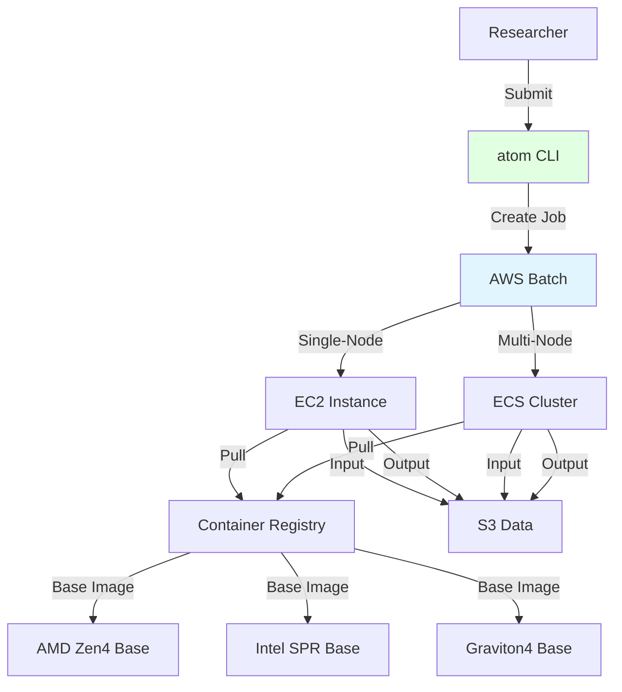

# ⚛️ atom

**Automated Toolkit for Optimized Modeling**

*Cloud-native HPC made simple*

[Visit atomhpc.io →](https://atomhpc.io) | [GitHub →](https://github.com/scttfrdmn/atom)

## Overview

atom is a cloud-native high-performance computing platform for running scientific applications with architecture-optimized containers and cost-efficient job scheduling. Built from the ground up for modern research computing without the complexity of traditional HPC cluster management.

> *The fundamental unit of cloud computing*

## Key Features

### Architecture-Optimized
- **AMD EPYC** - Zen 2, Zen 3, Zen 4 optimized builds
- **Intel Xeon** - Cascade Lake, Ice Lake, Sapphire Rapids
- **ARM Graviton** - Graviton 2, Graviton 3, Graviton 4
- **Processor-Specific** - BLIS, MKL, ARM Performance Libraries

### Application-Agnostic Platform
- **Pluggable Applications** - Add new apps without platform changes
- **Layered Containers** - Shared base images, fast app builds
- **Version Independence** - Platform and apps version separately
- **Multi-Application** - GEOS-Chem, Gaussian, WRF, VASP, ORCA

### Cost-Optimized
- **Spot Instances** - Up to 90% savings vs on-demand
- **Priority Queues** - Balance cost and urgency
- **Architecture Selection** - Automatic best price/performance
- **Cost Estimation** - Know costs before running

### Job Management
- **AWS Batch** - Managed job scheduling
- **Single-Node & MPI** - OpenMP and distributed workloads
- **Retry Logic** - Automatic spot interruption handling
- **Monitoring** - CloudWatch integration, job telemetry

## Supported Applications

| Application | Type | Status | Domain |
|-------------|------|--------|--------|
| **GEOS-Chem** | Classic & GCHP | ✅ Active | Atmospheric Chemistry |
| **Gaussian** | Single-node | 🚧 Planned | Quantum Chemistry |
| **WRF** | MPI | 🚧 Planned | Weather Modeling |
| **VASP** | MPI | 📋 Roadmap | Materials Science |
| **ORCA** | Single-node | 📋 Roadmap | Computational Chemistry |

## Architecture



## Container Strategy

### Layered Architecture

```
Base Images (maintained separately):
├── hpc-base-amd-zen4:latest
│   └── GCC, OpenMPI, AMD AOCL (BLIS + libFLAME)
├── hpc-base-intel-spr:latest
│   └── GCC, OpenMPI, Intel MKL
└── hpc-base-arm-graviton4:latest
    └── GCC, OpenMPI, ARM Performance Libraries

Application Layers (versioned independently):
├── geos-chem:14.4.3-c7a
│   └── FROM hpc-base-amd-zen4:latest
├── geos-chem:14.4.3-c7i
│   └── FROM hpc-base-intel-spr:latest
└── gaussian:16-c7a
    └── FROM hpc-base-amd-zen4:latest
```

**Benefits:**
- Base images shared across applications
- Faster application builds (no recompiling libraries)
- Version applications independently from infrastructure
- Security updates to base propagate to all apps

## Application Types

### Classic (Single-Node, OpenMP)
Applications that run on a single EC2 instance with shared memory parallelism.

**Examples:** GEOS-Chem Classic, Gaussian, ORCA, NWChem (single-node)

**Instance Families:** c7a (AMD Zen 4), c7i (Intel Sapphire Rapids), c8g (Graviton 4)

**Best For:** Small to medium workloads, memory-intensive applications

### MPI (Multi-Node, Distributed)
Applications that run across multiple EC2 instances with message passing.

**Examples:** GEOS-Chem High Performance (GCHP), WRF, VASP, NWChem (MPI)

**Networking:** EFA (Elastic Fabric Adapter) for low latency

**Best For:** Large-scale simulations, domain decomposition workloads

## Getting Started

### Install CLI

```bash
# Install via Homebrew
brew install atom

# Or download from releases
curl -LO https://github.com/scttfrdmn/atom/releases/latest/download/atom-darwin-amd64
chmod +x atom-darwin-amd64
sudo mv atom-darwin-amd64 /usr/local/bin/atom
```

### Deploy an Application

```bash
# Deploy GEOS-Chem application
atom app deploy geos-chem --env benchmark

# List deployed applications
atom app list

# View application details
atom app describe geos-chem
```

### Submit a Job

```bash
# Submit GEOS-Chem Classic job
atom job submit geos-chem \
  --config benchmark.yaml \
  --architecture c7a \
  --input s3://my-bucket/input/ \
  --output s3://my-bucket/output/

# Submit GCHP (MPI) job
atom job submit gchp \
  --config c48.yaml \
  --nodes 6 \
  --architecture c7a \
  --input s3://my-bucket/input/ \
  --output s3://my-bucket/output/

# Monitor job
atom job status <job-id>

# View logs
atom job logs <job-id>

# Get job costs
atom job cost <job-id>
```

## Use Cases

### Atmospheric Modeling
Run GEOS-Chem Classic and GCHP simulations with architecture-optimized builds for 2-3x performance improvement.

### Quantum Chemistry
Execute Gaussian and ORCA calculations with cost-efficient spot instances and automatic retry on interruption.

### Weather Modeling
Deploy WRF simulations across multiple nodes with EFA networking for low-latency MPI communication.

### Materials Science
Run VASP calculations on cost-optimized instances with AMD or Graviton processors.

## Integration with ResearchComputing

### Development Workflow
1. Develop and test in **lens** or **cloudworkspaces**
2. Submit production jobs to **atom**
3. Archive results with **cargoship**

### Account Management
- Provision via **petri**
- Cost tracking per project
- Budget alerts

### Hybrid Computing
- Use **orca** to burst from on-premises Kubernetes to atom workloads

## Performance

Architecture-optimized containers deliver significant performance improvements:

| Application | Generic | AMD Zen 4 | Intel SPR | ARM Graviton4 |
|-------------|---------|-----------|-----------|---------------|
| GEOS-Chem Classic | 1.0x | 2.3x | 2.1x | 1.8x |
| GCHP (96 cores) | 1.0x | 2.8x | 2.5x | 2.0x |
| Gaussian (DFT) | 1.0x | 2.2x | 2.4x | 1.7x |

*Benchmarks vs generic x86_64 builds without processor-specific optimization*

## Cost Optimization

### Spot Instances
- Up to 90% savings vs on-demand
- Automatic retry on interruption
- Checkpointing for long jobs

### Priority Queues
- **Urgent** - On-demand instances, immediate start
- **Standard** - Spot with fallback, cost-balanced
- **Economy** - Spot only, maximum savings

### Architecture Selection
atom automatically selects the most cost-effective architecture for your workload based on current spot prices.

## Documentation

- [Platform Architecture](https://atomhpc.io/platform/architecture)
- [Adding Applications](https://atomhpc.io/platform/adding-applications)
- [Container Build System](https://atomhpc.io/platform/containers)
- [Job Submission Guide](https://atomhpc.io/user-guide/submitting-jobs)
- [Application: GEOS-Chem](https://atomhpc.io/applications/geos-chem)

## Technology Stack

- **Language:** Go (CLI, platform), Bash (containers)
- **Infrastructure:** AWS Batch, ECS, CloudFormation/CDK
- **Containers:** Docker, Amazon ECR
- **Networking:** VPC, EFA (for MPI)
- **Storage:** S3, EBS, EFS (optional)
- **Compilers:** GCC, Intel oneAPI
- **MPI:** OpenMPI
- **Math Libraries:** BLIS, libFLAME, MKL, ARM PL

## Project Status

**Current Version:** v0.1.0-alpha
**Platform API:** v1.0.0-dev
**Status:** 🚧 Active Development

The platform is being extracted from [aws-geos-chem](https://github.com/scttfrdmn/aws-geos-chem) to create a reusable foundation for multiple scientific applications.

**Target Release:** Q1 2026

## Contributing

Contributions welcome! See the [contribution guide](https://github.com/scttfrdmn/atom/blob/main/CONTRIBUTING.md).

Interested in adding your application? Check out the [Adding Applications Guide](https://atomhpc.io/platform/adding-applications).

## Support

- **Documentation:** [atomhpc.io](https://atomhpc.io)
- **Issues:** [GitHub Issues](https://github.com/scttfrdmn/atom/issues)
- **Discussions:** [GitHub Discussions](https://github.com/scttfrdmn/atom/discussions)

---

[← Back to Ecosystem](/ecosystem/overview)
