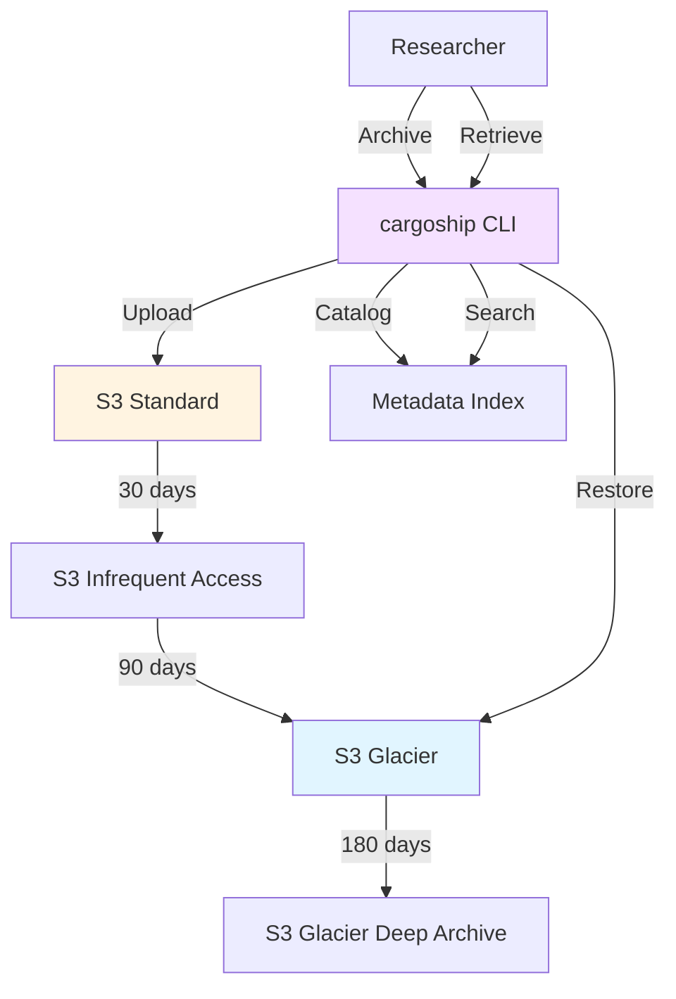

# 🚢 cargoship

**Enterprise data archiving for research**

[Visit cargoship.io →](https://cargoship.io) | [GitHub →](https://github.com/scttfrdmn/cargoship)

## Overview

cargoship provides S3-optimized long-term data storage and archiving for research data. It manages data lifecycle, compression, deduplication, and retrieval for cost-effective long-term storage of computational results and datasets.

## Key Features

### Lifecycle Management
- **Intelligent Tiering** - Automatic S3 tier transitions
- **Archive Policies** - Hot → Warm → Cold → Glacier
- **Retention Rules** - Compliance and regulatory requirements
- **Expiration** - Automatic cleanup of temporary data

### Data Optimization
- **Compression** - Transparent compression for archives
- **Deduplication** - Block-level dedup for efficiency
- **Metadata Indexing** - Fast search without retrieval
- **Checksums** - Data integrity verification

### Cost Management
- **Storage Classes** - S3 Standard, IA, Glacier, Deep Archive
- **Cost Estimation** - Calculate storage costs before archiving
- **Usage Reports** - Per-project and per-user breakdowns
- **Budget Alerts** - Notifications at spending thresholds

### Data Discovery
- **Metadata Search** - Find archives without downloading
- **Tagging** - Organize by project, user, date
- **Cataloging** - Browse archives via web interface
- **Full-Text Search** - Search within archive metadata

## Use Cases

### Research Data Archiving
Archive computational results, simulation outputs, and processed datasets for long-term retention.

### Compliance and Retention
Meet data retention requirements for grants, regulations, and institutional policies.

### Cold Storage
Store infrequently accessed data cost-effectively in Glacier or Deep Archive.

### Dataset Preservation
Preserve published datasets associated with papers and ensure long-term accessibility.

## Architecture



## Storage Tiers

### Hot (S3 Standard)
- **Use Case:** Frequently accessed data
- **Retrieval:** Instant
- **Cost:** $0.023/GB/month
- **Transition:** After 30 days → Warm

### Warm (S3 IA)
- **Use Case:** Occasionally accessed data
- **Retrieval:** Instant
- **Cost:** $0.0125/GB/month
- **Transition:** After 90 days → Cold

### Cold (S3 Glacier Instant Retrieval)
- **Use Case:** Rarely accessed, instant when needed
- **Retrieval:** Instant
- **Cost:** $0.004/GB/month
- **Transition:** After 180 days → Deep Archive

### Deep Archive (S3 Glacier Deep Archive)
- **Use Case:** Long-term archival, rarely retrieved
- **Retrieval:** 12-48 hours
- **Cost:** $0.00099/GB/month
- **Transition:** Permanent archive

## Getting Started

### Install CLI

```bash
# Install cargoship CLI
brew install cargoship

# Or download from releases
curl -LO https://github.com/scttfrdmn/cargoship/releases/latest/download/cargoship-darwin-amd64
chmod +x cargoship-darwin-amd64
sudo mv cargoship-darwin-amd64 /usr/local/bin/cargoship
```

### Archive Data

```bash
# Archive a directory
cargoship archive \
  --path /results/experiment-1 \
  --name "Experiment 1 Results" \
  --project "Atmospheric Chemistry" \
  --tier standard

# Archive with custom lifecycle
cargoship archive \
  --path /results/simulation \
  --name "Q1 2025 Simulation Data" \
  --lifecycle deep-archive \
  --compression gzip

# Archive from S3
cargoship archive \
  --source s3://my-bucket/results/ \
  --name "Batch Job Results" \
  --tier glacier
```

### Search and Retrieve

```bash
# List archives
cargoship list

# Search by metadata
cargoship search \
  --project "Atmospheric Chemistry" \
  --date-after 2025-01-01

# Search by tags
cargoship search \
  --tag experiment-type:simulation \
  --tag model:geos-chem

# Retrieve archive
cargoship retrieve \
  --archive-id arch-abc123 \
  --output /restore/experiment-1

# Restore from Glacier (initiate retrieval)
cargoship restore \
  --archive-id arch-def456 \
  --tier expedited  # or standard, bulk
```

### Manage Archives

```bash
# View archive details
cargoship describe arch-abc123

# Add tags
cargoship tag arch-abc123 \
  --tag publication:doi-10.1234/example

# Update metadata
cargoship update arch-abc123 \
  --description "Updated description"

# Set retention policy
cargoship retention arch-abc123 \
  --keep-until 2030-01-01

# Delete archive (if allowed)
cargoship delete arch-abc123
```

## Integration with ResearchComputing

### Workflow Integration

```bash
# Archive atom job results
atom job submit geos-chem ... | tee job-id.txt
atom job wait $(cat job-id.txt)
cargoship archive \
  --source s3://atom-results/$(cat job-id.txt)/ \
  --name "GEOS-Chem Run $(cat job-id.txt)"

# Archive prism workspace data
prism export my-workspace --to /tmp/workspace-data
cargoship archive \
  --path /tmp/workspace-data \
  --name "ML Experiment Workspace"

# Archive lens notebooks
lens export my-notebook --with-outputs --to /tmp/notebooks
cargoship archive \
  --path /tmp/notebooks \
  --name "Research Notebooks Q1 2025"
```

### Automated Archiving
cargoship can automatically archive results from other ResearchComputing tools:

- **atom** - Archive job results after completion
- **prism** - Archive workspace snapshots
- **lens** - Archive notebooks and environments
- **S3 buckets** - Automatic lifecycle policies

## Features

### Compression
- **Transparent** - Compress on archive, decompress on retrieve
- **Formats** - gzip, bzip2, xz, zstd
- **Automatic** - Select best compression based on data type

### Deduplication
- **Block-Level** - Deduplicate at block level (4MB blocks)
- **Cross-Archive** - Dedup across all archives
- **Storage Savings** - Typically 30-60% savings for similar datasets

### Metadata
```json
{
  "archive_id": "arch-abc123",
  "name": "Experiment 1 Results",
  "project": "Atmospheric Chemistry",
  "created": "2025-01-15T10:30:00Z",
  "size_bytes": 107374182400,
  "compressed_size": 53687091200,
  "files": 1523,
  "storage_class": "GLACIER",
  "tags": {
    "experiment-type": "simulation",
    "model": "geos-chem",
    "version": "14.4.3"
  },
  "checksum": "sha256:abcd1234..."
}
```

### Cost Estimation

```bash
# Estimate storage costs
cargoship estimate \
  --size 100GB \
  --tier glacier \
  --duration 5years

# Output:
# Tier: Glacier
# Size: 100 GB
# Duration: 5 years
# Estimated cost: $24.00
```

## Documentation

- [Getting Started Guide](https://cargoship.io/docs/getting-started)
- [Storage Tiers Guide](https://cargoship.io/docs/storage-tiers)
- [Lifecycle Policies](https://cargoship.io/docs/lifecycle)
- [Retrieval Guide](https://cargoship.io/docs/retrieval)

## Technology Stack

- **Language:** Go
- **Storage:** S3, S3 Glacier, S3 Glacier Deep Archive
- **Metadata:** DynamoDB
- **Compression:** zlib, bzip2, xz, zstd
- **Infrastructure:** CloudFormation, Lambda

## Project Status

**Current Version:** v0.4.0
**Status:** Active Development
**License:** Apache 2.0

## Contributing

Contributions welcome! See the [contribution guide](https://github.com/scttfrdmn/cargoship/blob/main/CONTRIBUTING.md).

## Support

- **Documentation:** [cargoship.io](https://cargoship.io)
- **Issues:** [GitHub Issues](https://github.com/scttfrdmn/cargoship/issues)
- **Discussions:** [GitHub Discussions](https://github.com/scttfrdmn/cargoship/discussions)

---

[← Back to Ecosystem](/ecosystem/overview)
