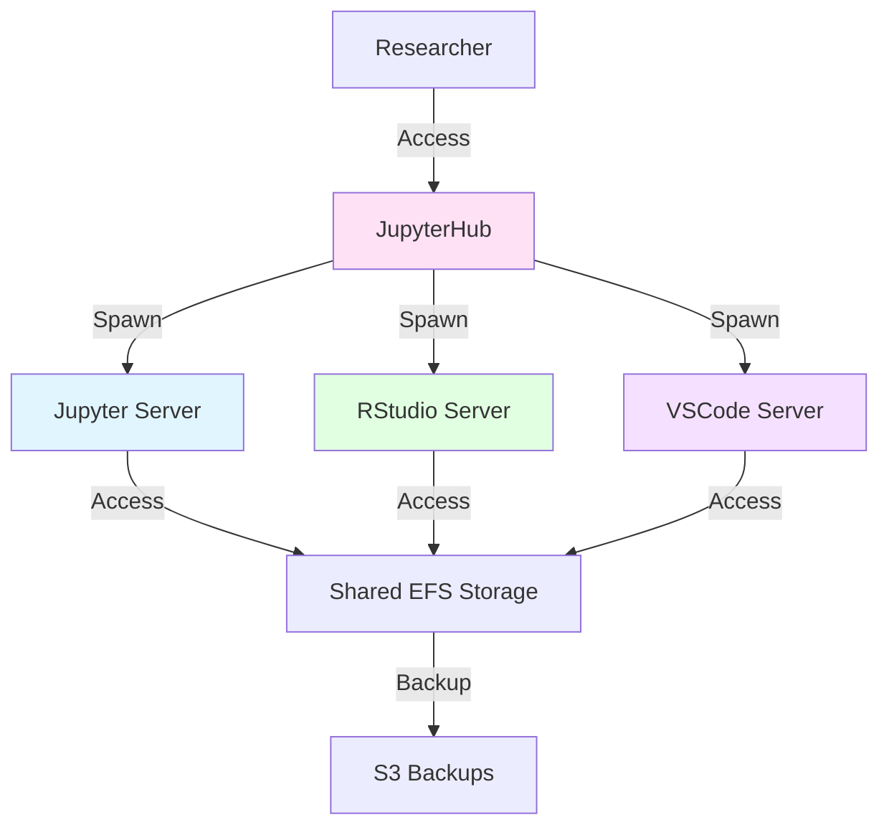

# 🔬 lens

**Lab Environment Notebook System**

[Visit lenslab.io →](https://lenslab.io) | [GitHub →](https://github.com/scttfrdmn/lens)

## Overview

lens provides flexible, reproducible computational environments for researchers including Jupyter notebooks, RStudio Server, and VSCode Server. Designed specifically for computational research workflows with multi-language support and collaborative features.

## Key Features

### Multiple Environments
- **Jupyter** - Classic Notebook, JupyterLab, and JupyterHub
- **RStudio Server** - Full-featured R development environment
- **VSCode Server** - Browser-based VSCode for remote development
- **Terminal Access** - SSH and web-based terminals

### Language Support
- **Python** - Multiple versions with scientific stack
- **R** - R 4.3+ with Tidyverse and Bioconductor
- **Julia** - Julia 1.9+ for high-performance computing
- **Multi-Language** - Use Python, R, and Julia in same notebook

### Collaboration
- **Multi-User** - JupyterHub for team access
- **Shared Projects** - Collaborative workspaces
- **Version Control** - Git integration
- **Real-Time Sharing** - Share live sessions

### Reproducibility
- **Container-Based** - Consistent environments via Docker
- **Environment Files** - conda/pip/renv reproducible configs
- **Snapshots** - Save environment state
- **Version Tracking** - Track package versions

## Use Cases

### Computational Research
Develop computational models and analyze data with Jupyter notebooks and interactive R sessions.

### Data Analysis
Perform statistical analysis with RStudio and visualize results interactively.

### Teaching and Workshops
Provide students with consistent notebook environments for computational courses.

### Collaborative Projects
Enable teams to work together in shared computational environments.

## Architecture



## Available Environments

### Python Environments
- **Data Science** - pandas, NumPy, scikit-learn, Matplotlib
- **Geospatial** - GeoPandas, Rasterio, Shapely
- **Bioinformatics** - Biopython, scanpy, AnnData
- **Machine Learning** - PyTorch, TensorFlow (CPU)

### R Environments
- **Tidyverse** - dplyr, ggplot2, tidyr, readr
- **Bioconductor** - DESeq2, edgeR, Seurat
- **Spatial** - sf, terra, stars
- **Statistics** - lme4, survival, caret

### Julia Environments
- **Scientific Computing** - DifferentialEquations.jl
- **Data Analysis** - DataFrames.jl, Plots.jl
- **Optimization** - JuMP.jl, Optim.jl

## Getting Started

### Launch an Environment

```bash
# Install lens CLI
brew install lens

# List available environments
lens list-environments

# Launch Jupyter environment
lens launch jupyter \
  --name my-notebook \
  --environment datascience-python

# Launch RStudio environment
lens launch rstudio \
  --name my-rstudio \
  --environment tidyverse

# Launch VSCode environment
lens launch vscode \
  --name my-vscode \
  --environment julia
```

### Access Your Environment

```bash
# Get connection URL
lens url my-notebook

# Open in browser
lens open my-notebook

# Connect via SSH for tunneling
lens ssh my-notebook
```

### Manage Environments

```bash
# List running environments
lens list

# Stop environment (preserves data)
lens stop my-notebook

# Start stopped environment
lens start my-notebook

# Export environment config
lens export my-notebook > environment.yml

# Create from config
lens create --from environment.yml --name reproduced
```

## Pre-Installed Packages

### Python Scientific Stack
```python
# Core libraries
import numpy as np
import pandas as pd
import matplotlib.pyplot as plt
import seaborn as sns

# Machine learning
import sklearn
import scipy

# Geospatial
import geopandas as gpd
import rasterio
```

### R Tidyverse
```r
# Core tidyverse
library(tidyverse)
library(readr)
library(dplyr)
library(ggplot2)

# Statistics
library(lme4)
library(survival)

# Bioconductor
library(DESeq2)
library(edgeR)
```

### Julia
```julia
# Data analysis
using DataFrames
using CSV
using Plots

# Scientific computing
using DifferentialEquations
using Optim
```

## Integration with ResearchComputing

### Development Workflow
1. Develop and test in **lens** notebooks
2. Export code for batch execution
3. Scale to **atom** for HPC runs
4. Archive notebooks and results in **cargoship**

### Data Pipeline
- Load data from S3
- Process in interactive notebooks
- Export results back to S3
- Retrieve archived data from **cargoship**

### Account Provisioning
- Accounts managed via **petri**
- Cost tracking and budgets
- Multi-user access control

## Features

### Jupyter Features
- **Extensions** - JupyterLab extensions for productivity
- **Kernels** - Python, R, Julia, and more
- **Widgets** - Interactive widgets with ipywidgets
- **Export** - Export to HTML, PDF, slides

### RStudio Features
- **Projects** - RStudio projects for organization
- **Git Integration** - Built-in version control
- **Package Management** - renv for reproducibility
- **Shiny** - Deploy Shiny apps for interactive dashboards

### VSCode Features
- **Extensions** - Python, R, Julia extensions
- **Remote Development** - Full VSCode experience
- **Debugging** - Interactive debugging
- **Terminal** - Integrated terminal

## Documentation

- [Getting Started Guide](https://lenslab.io/docs/getting-started)
- [Jupyter Guide](https://lenslab.io/docs/jupyter)
- [RStudio Guide](https://lenslab.io/docs/rstudio)
- [VSCode Guide](https://lenslab.io/docs/vscode)
- [Environment Management](https://lenslab.io/docs/environments)

## Technology Stack

- **Environments:** JupyterHub, RStudio Server, code-server
- **Containers:** Docker, custom images
- **Storage:** EFS (shared), EBS (local)
- **Authentication:** JupyterHub authenticators, OAuth
- **Infrastructure:** ECS, ALB, CloudFormation

## Project Status

**Current Version:** v0.5.0
**Status:** Active Development
**License:** Apache 2.0

## Contributing

Contributions welcome! See the [contribution guide](https://github.com/scttfrdmn/lens/blob/main/CONTRIBUTING.md).

## Support

- **Documentation:** [lenslab.io](https://lenslab.io)
- **Issues:** [GitHub Issues](https://github.com/scttfrdmn/lens/issues)
- **Discussions:** [GitHub Discussions](https://github.com/scttfrdmn/lens/discussions)

---

[← Back to Ecosystem](/ecosystem/overview)
