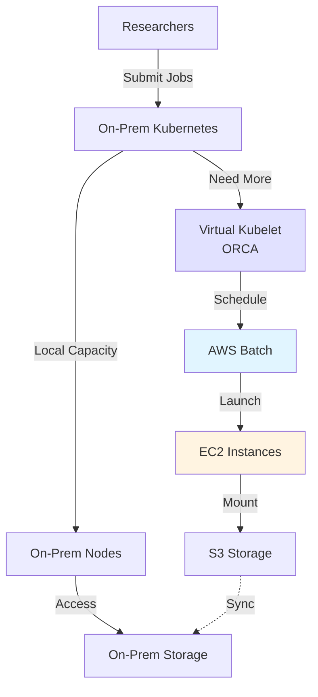

# 🐋 orca

**Orchestration for Research Cloud Access**

[Visit orcapod.io →](https://orcapod.io) | [GitHub →](https://github.com/scttfrdmn/orca)

## Overview

orca enables Kubernetes-to-AWS burst computing, seamlessly extending on-premises clusters to the cloud. Scale workloads from local infrastructure to AWS when additional capacity is needed without re-architecting applications or workflows.

**ORCA** = **O**rchestration for **R**esearch **C**loud **A**ccess

## Key Features

### Kubernetes Integration
- **Virtual Kubelet** - Extends K8s to AWS seamlessly
- **Native Workloads** - Run existing K8s workloads unchanged
- **Pod Scheduling** - Transparent scheduling to cloud resources
- **API Compatibility** - Standard Kubernetes API

### Burst Computing
- **On-Demand Scaling** - Scale to cloud when on-prem full
- **Cost-Efficient** - Only pay for what you use, when you need it
- **Automatic Fallback** - Return to on-prem when capacity available
- **Hybrid Workloads** - Run some pods on-prem, some in AWS

### Cloud Backend
- **AWS Batch** - Managed batch computing
- **Spot Instances** - Cost savings with spot
- **Multiple Architectures** - x86, ARM Graviton support
- **EFA Networking** - Low-latency MPI for HPC

### Workload Support
- **Batch Jobs** - Scientific computing, simulations
- **MPI Workloads** - Multi-node parallel jobs
- **GPU Workloads** - ML training, rendering
- **Containerized** - Any container can burst to AWS

## Use Cases

### HPC Center Burst Capacity
Extend on-premises Slurm or Kubernetes cluster to AWS during peak demand periods.

### Research Lab Scaling
Small on-premises cluster with ability to scale to hundreds of nodes in AWS for large experiments.

### Cost Optimization
Maintain smaller on-premises infrastructure, burst to cloud for occasional large workloads.

### Hybrid Workflows
Keep sensitive data on-premises while running compute-intensive tasks in AWS.

## Architecture



## How It Works

### 1. Install ORCA Virtual Kubelet
ORCA runs as a virtual kubelet provider in your Kubernetes cluster.

```bash
# Deploy ORCA to your cluster
kubectl apply -f https://orcapod.io/deploy/latest.yaml

# Configure AWS credentials
kubectl create secret generic orca-aws \
  --from-literal=access-key=$AWS_ACCESS_KEY_ID \
  --from-literal=secret-key=$AWS_SECRET_ACCESS_KEY
```

### 2. Label Workloads for Burst
Add labels to pods that can burst to AWS.

```yaml
apiVersion: batch/v1
kind: Job
metadata:
  name: my-simulation
spec:
  template:
    metadata:
      labels:
        orca.researchcomputing.io/burst: "enabled"
    spec:
      containers:
      - name: simulation
        image: my-simulation:latest
        resources:
          requests:
            cpu: "16"
            memory: "64Gi"
```

### 3. Automatic Scheduling
When on-premises capacity is full, ORCA automatically schedules pods to AWS.

```bash
# Submit workload
kubectl apply -f simulation-job.yaml

# Check scheduling
kubectl get pods -o wide
# NAME                         NODE
# simulation-1                 on-prem-node-1
# simulation-2                 on-prem-node-2
# simulation-3                 orca-aws-node
# simulation-4                 orca-aws-node
```

## Configuration

### Burst Policies

```yaml
apiVersion: orca.researchcomputing.io/v1
kind: BurstPolicy
metadata:
  name: default-burst
spec:
  # When to burst
  trigger:
    onPremCapacity: 80%  # Burst when on-prem 80% full
    queueWaitTime: 5m     # Or after 5 min in queue

  # Where to burst
  target:
    provider: aws
    region: us-east-1
    instanceTypes:
      - c7a.16xlarge
      - c7i.16xlarge
      - c8g.16xlarge
    spot: true            # Use spot instances

  # Cost controls
  maxCost: 1000          # Max $1000/day in AWS
  maxNodes: 50           # Max 50 burst nodes
```

### Storage Sync

```yaml
apiVersion: orca.researchcomputing.io/v1
kind: StorageSync
metadata:
  name: research-data
spec:
  source:
    type: nfs
    path: /mnt/research
  destination:
    type: s3
    bucket: research-data-sync
  sync:
    direction: bidirectional
    schedule: "*/15 * * * *"  # Every 15 minutes
```

## Integration with ResearchComputing

### Hybrid Workflows

```bash
# 1. Development on-premises (lens or cloudworkspaces)
# 2. Small tests on on-prem K8s
# 3. Large production runs burst to AWS via ORCA
# 4. Results stored in S3 and synced back
# 5. Archive with cargoship
```

### ORCA + ATOM
ORCA can target ATOM workloads for architecture-optimized HPC:

```yaml
spec:
  target:
    provider: atom
    application: geos-chem
    architecture: c7a  # AMD Zen 4 optimized
```

### Account Management
- Provision AWS accounts via **petri**
- Cost tracking per project
- Budget alerts for burst spending

## Getting Started

### Prerequisites
- Kubernetes cluster (1.24+)
- AWS account
- kubectl configured

### Installation

```bash
# Install ORCA CLI
brew install orca

# Or download from releases
curl -LO https://github.com/scttfrdmn/orca/releases/latest/download/orca-darwin-amd64
chmod +x orca-darwin-amd64
sudo mv orca-darwin-amd64 /usr/local/bin/orca

# Deploy to cluster
orca install \
  --aws-region us-east-1 \
  --aws-account-id 123456789012

# Verify installation
kubectl get nodes
# NAME                  STATUS   ROLE
# on-prem-node-1       Ready    worker
# on-prem-node-2       Ready    worker
# orca-virtual-node    Ready    virtual
```

### Submit Burst Job

```bash
# Create burst-enabled job
cat <<EOF | kubectl apply -f -
apiVersion: batch/v1
kind: Job
metadata:
  name: molecular-dynamics
spec:
  parallelism: 16
  template:
    metadata:
      labels:
        orca.io/burst: "enabled"
        orca.io/priority: "high"
    spec:
      containers:
      - name: md-simulation
        image: my-org/md-sim:latest
        resources:
          requests:
            cpu: "4"
            memory: "16Gi"
      restartPolicy: Never
EOF

# Monitor job
orca job status molecular-dynamics

# Check costs
orca cost summary --job molecular-dynamics
```

## Cost Management

### Cost Estimation

```bash
# Estimate burst costs
orca estimate \
  --cpus 256 \
  --memory 1024 \
  --duration 4h \
  --spot

# Output:
# Instance type: c7a.16xlarge (spot)
# Instances needed: 4
# Duration: 4 hours
# Estimated cost: $12.80
```

### Budget Controls

```yaml
apiVersion: orca.researchcomputing.io/v1
kind: Budget
metadata:
  name: lab-budget
spec:
  limit: 5000  # $5000/month
  alerts:
    - threshold: 80%
      notify: lab-admin@university.edu
    - threshold: 100%
      action: pause-burst
```

## Documentation

- [Installation Guide](https://orcapod.io/docs/installation)
- [Configuration Reference](https://orcapod.io/docs/configuration)
- [Burst Policies](https://orcapod.io/docs/burst-policies)
- [Storage Sync Guide](https://orcapod.io/docs/storage-sync)
- [Cost Management](https://orcapod.io/docs/cost-management)

## Technology Stack

- **Language:** Go
- **Orchestration:** Virtual Kubelet
- **Cloud Provider:** AWS (Batch, ECS, EC2)
- **Storage Sync:** S3 sync, FSx for Lustre
- **Monitoring:** Prometheus, CloudWatch

## Project Status

**Current Version:** v0.6.0
**Status:** Beta
**License:** Apache 2.0

## Contributing

Contributions welcome! See the [contribution guide](https://github.com/scttfrdmn/orca/blob/main/CONTRIBUTING.md).

## Support

- **Documentation:** [orcapod.io](https://orcapod.io)
- **Issues:** [GitHub Issues](https://github.com/scttfrdmn/orca/issues)
- **Discussions:** [GitHub Discussions](https://github.com/scttfrdmn/orca/discussions)
- **Slack:** [Join #orca](https://researchcomputing.slack.com/orca)

---

[← Back to Ecosystem](/ecosystem/overview)
