# Ecosystem Overview

The ResearchComputing ecosystem provides a comprehensive suite of integrated tools for cloud-based research computing. Each tool addresses a specific need in the research computing lifecycle, and they're designed to work together seamlessly.

## Architecture

```mermaid
graph TB
    subgraph "Account Management"
        Petri[🧫 petri<br/>Account Provisioning]
    end

    subgraph "Interactive Computing"
        CW[🖥️ cloudworkspaces<br/>Workstations]
        Lens[🔬 lens<br/>Notebooks]
    end

    subgraph "Batch Computing"
        ATOM[⚛️ atom<br/>HPC Platform]
        ORCA[🐋 orca<br/>K8s Burst]
    end

    subgraph "Storage"
        Cargo[🚢 cargoship<br/>Archive]
    end

    Petri -->|Provisions| CW
    Petri -->|Provisions| Lens
    Petri -->|Provisions| ATOM

    CW -->|Store Results| Cargo
    Lens -->|Store Results| Cargo
    ATOM -->|Store Results| Cargo
    ORCA -->|Store Results| Cargo

    ORCA -.->|Burst to| ATOM

    style Petri fill:#e1f5ff
    style CW fill:#fff4e1
    style Lens fill:#ffe1f5
    style ATOM fill:#e1ffe1
    style Cargo fill:#f5e1ff
    style ORCA fill:#e1e1ff
```



## Components

### Account Management Layer

#### 🧫 petri
Research-focused AWS account management that handles:
- Account provisioning for research groups
- Budget allocation and tracking
- Organizational policies and compliance
- Multi-lab account management

**Technology:** AWS Organizations, Service Control Policies, Cost Explorer integration

---

### Interactive Computing Layer

#### 🖥️ cloudworkspaces
Pre-configured cloud workstations for interactive work:
- GPU-powered workstations
- Pre-installed ML frameworks
- Data science environments
- Collaborative sessions

**Technology:** EC2, EBS, CloudFormation, custom AMIs

#### 🔬 lens
Development environments for computational research:
- Jupyter notebooks
- RStudio Server
- VSCode Server
- Teaching and workshop environments

**Technology:** Container-based, JupyterHub, RStudio Server, code-server

---

### Batch Computing Layer

#### ⚛️ atom
Cloud-native HPC platform:
- Architecture-optimized containers (AMD, Intel, ARM)
- Single-node and MPI workloads
- Cost-optimized job scheduling
- Application-agnostic platform

**Technology:** AWS Batch, Docker, ECS, Spot instances

**Applications:** GEOS-Chem, Gaussian, WRF, VASP, ORCA

#### 🐋 orca
Kubernetes-to-AWS burst computing:
- Extend on-premises K8s to AWS
- Hybrid cloud workflows
- Seamless workload migration
- Cost-effective scaling

**Technology:** Kubernetes, Virtual Kubelet, EKS, AWS Batch

---

### Storage Layer

#### 🚢 cargoship
Enterprise data archiving:
- Long-term data storage
- Lifecycle management
- Compression and deduplication
- Cost-optimized retrieval

**Technology:** S3, Glacier, lifecycle policies, metadata indexing

---

## Integration Patterns

### Pattern 1: Full Research Lifecycle

```
petri → cloudworkspaces → atom → cargoship
```

1. **petri** provisions AWS account for research lab
2. **cloudworkspaces** provides interactive environment for exploration
3. **atom** runs production HPC simulations
4. **cargoship** archives results for long-term storage

**Use Case:** Atmospheric chemistry research lab

---

### Pattern 2: Notebook-to-Production

```
petri → lens → atom → cargoship
```

1. **petri** provisions account
2. **lens** provides Jupyter environment for development
3. **atom** scales notebook code to HPC batch jobs
4. **cargoship** stores processed datasets

**Use Case:** Machine learning research

---

### Pattern 3: Hybrid Cloud

```
On-Prem K8s → orca → AWS Batch → cargoship
```

1. Local Kubernetes cluster runs baseline workloads
2. **orca** bursts to AWS when capacity needed
3. AWS Batch executes scaled workloads
4. **cargoship** stores results

**Use Case:** HPC center extending on-premises infrastructure

---

### Pattern 4: Teaching and Workshops

```
petri → lens + cloudworkspaces
```

1. **petri** provisions temporary accounts for class
2. **lens** provides notebook environments for students
3. **cloudworkspaces** offers GPU access for advanced students

**Use Case:** University computational science course

---

## Design Principles

### 1. Separation of Concerns
Each tool has a focused responsibility and clean interfaces to other components.

### 2. Cloud-Native Architecture
Built for the cloud from the ground up, not adapted from legacy HPC systems.

### 3. Container-Based
Reproducible environments using Docker containers for consistency.

### 4. Cost Transparency
All tools show estimated and actual costs to users.

### 5. Security by Default
Private networking, encryption at rest and in transit, least-privilege IAM.

### 6. Open Source
All projects are open source and can be used independently or together.

## Technology Stack

### Infrastructure as Code
- **AWS CDK** - Primary IaC tool for AWS resources
- **Terraform** - Alternative for multi-cloud scenarios
- **CloudFormation** - Generated by CDK for deployment

### Container Orchestration
- **Docker** - Container runtime
- **AWS Batch** - Managed batch computing
- **Amazon ECS** - Container orchestration
- **Kubernetes** - On-premises and hybrid scenarios

### Programming Languages
- **Go** - CLI tools and APIs
- **Python** - Scientific workflows and utilities
- **TypeScript** - CDK infrastructure definitions
- **Bash** - Container entry points and scripts

### Documentation
- **MkDocs** - Documentation site generator
- **Material for MkDocs** - Theme and components
- **GitHub Pages** - Static site hosting

### CI/CD
- **GitHub Actions** - Build, test, deploy workflows
- **Docker Hub** - Container image registry
- **Amazon ECR** - Private container registry

## Common Features

All ResearchComputing tools share these features:

- ✅ **Infrastructure as Code** - Reproducible deployments
- ✅ **CLI Tools** - Simple command-line interfaces
- ✅ **Web Dashboards** - Optional web UIs for management
- ✅ **Cost Tracking** - Built-in cost visibility
- ✅ **IAM Integration** - AWS identity and access management
- ✅ **CloudWatch** - Centralized logging and monitoring
- ✅ **S3 Integration** - Standardized data storage
- ✅ **Tagging** - Resource tagging for cost allocation

## Versioning Strategy

Each tool versions independently:

- **Platform Versions** - Infrastructure and core APIs (e.g., atom v1.0)
- **Application Versions** - Scientific applications (e.g., GEOS-Chem 14.4.3)
- **Documentation** - Versioned docs with mike

Example: ATOM platform v1.0 can support GEOS-Chem 14.4.3, 14.4.2, and 15.0.0 simultaneously.

## Getting Help

### Per-Project Support
Each project has its own:
- GitHub Discussions for Q&A
- Issue trackers for bugs
- Documentation sites

### Community
- **Blog**: [researchcomputing.blog](https://researchcomputing.blog)
- **Twitter**: [@scttfrdmn](https://twitter.com/scttfrdmn)
- **GitHub**: [@scttfrdmn](https://github.com/scttfrdmn)

## Roadmap

### Current Focus (Q4 2025 - Q1 2026)
- **atom** - Platform development, GEOS-Chem extraction
- **lens** - Multi-environment notebook system
- **petri** - Account automation improvements

### Future Directions
- Multi-cloud support (Azure, GCP)
- Enhanced cost optimization
- Cross-tool workflow orchestration
- Federated identity management

---

**Ready to get started?** Visit the individual [project pages](/) to dive deeper into each tool.
