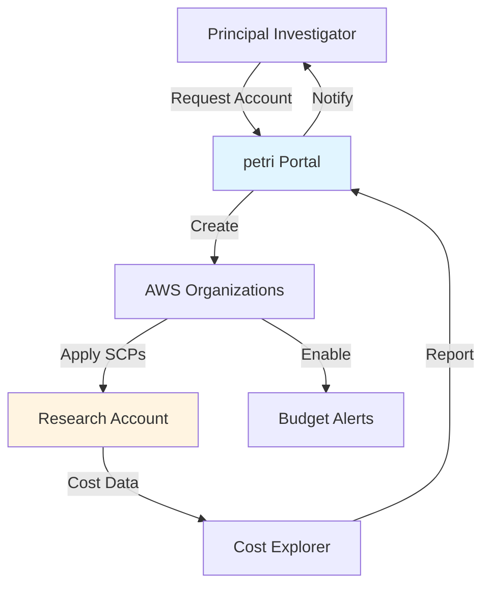

# 🧫 petri

**Research-focused AWS account management**

[Visit petri.io →](https://petri.io) | [GitHub →](https://github.com/scttfrdmn/petri)

## Overview

petri simplifies AWS account provisioning and management for academic research institutions. It handles the complexity of multi-account AWS Organizations, budget tracking, and organizational policies so research computing offices can focus on supporting their researchers.

## Key Features

### Account Provisioning
- **Self-Service Requests** - Researchers request accounts via web form
- **Automated Creation** - AWS Organizations API handles account creation
- **Policy Enforcement** - Service Control Policies (SCPs) applied automatically
- **Tagging Strategy** - Consistent resource tagging for cost allocation

### Budget Management
- **Budget Allocation** - Set spending limits per account/project
- **Cost Tracking** - Real-time visibility into spending
- **Alerts** - Email notifications at budget thresholds (50%, 80%, 100%)
- **Reporting** - Monthly cost reports per lab/department

### Governance
- **Organizational Units** - Hierarchical account organization
- **Compliance Policies** - Enforce security and compliance requirements
- **Audit Logging** - CloudTrail integration for audit trails
- **IAM Policies** - Centralized identity and access management

## Use Cases

### University Research Computing Office
Manage AWS accounts for 50+ research labs across campus with centralized billing and policy enforcement.

### Multi-Lab Research Centers
Provide isolated AWS environments for different PIs with shared organizational policies and budget oversight.

### Grant-Funded Projects
Create time-limited accounts for specific grants with automated budget alerts and decommissioning.

## Architecture



## Integration with ResearchComputing

### Downstream Services
Once petri provisions an account, researchers can deploy:

- **cloudworkspaces** - Interactive workstations
- **lens** - Jupyter and RStudio environments
- **atom** - HPC batch computing
- **cargoship** - Data archiving

### Cost Allocation
petri tags enable cost tracking across the ecosystem:
- Track spending per project
- Allocate costs to grants
- Generate reports for finance offices

## Getting Started

### For Administrators

```bash
# Install petri CLI
brew install petri

# Initialize organization
petri init --org-email admin@university.edu

# Create organizational units
petri ou create --name "Chemistry Department"
petri ou create --name "Physics Department"

# Configure default policies
petri policy apply --name baseline-security
```

### For Researchers

```bash
# Request new account
petri account request \
  --pi "Dr. Jane Smith" \
  --project "Atmospheric Chemistry Study" \
  --budget 5000 \
  --duration 12months

# Check account status
petri account status

# View current spending
petri cost summary
```

## Documentation

- [Installation Guide](https://petri.io/docs/installation)
- [Administrator Guide](https://petri.io/docs/admin)
- [User Guide](https://petri.io/docs/user)
- [Policy Templates](https://petri.io/docs/policies)

## Technology Stack

- **Language:** Go
- **Infrastructure:** AWS Organizations, Service Control Policies
- **Cost Management:** Cost Explorer, Budgets
- **Identity:** AWS IAM, IAM Identity Center
- **Web Portal:** React, AWS Amplify

## Project Status

**Current Version:** v0.3.0
**Status:** Active Development
**License:** Apache 2.0

## Contributing

Contributions welcome! See the [contribution guide](https://github.com/scttfrdmn/petri/blob/main/CONTRIBUTING.md).

## Support

- **Documentation:** [petri.io](https://petri.io)
- **Issues:** [GitHub Issues](https://github.com/scttfrdmn/petri/issues)
- **Discussions:** [GitHub Discussions](https://github.com/scttfrdmn/petri/discussions)

---

[← Back to Ecosystem](/ecosystem/overview)
