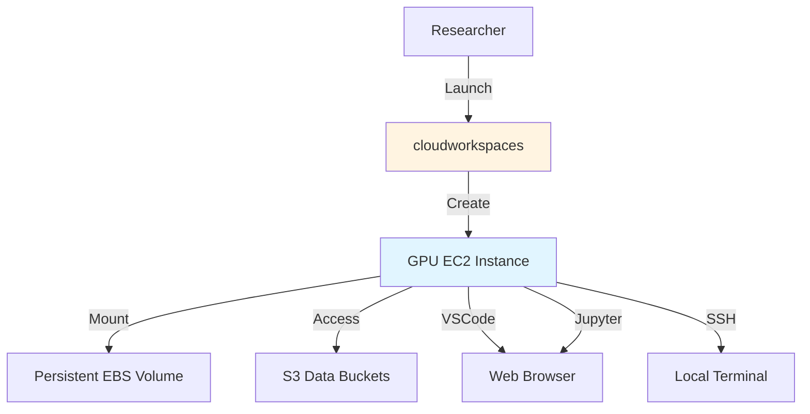

# 🔷 prism

**Interactive research workspaces in the cloud**

[Visit prismcloud.io →](https://prismcloud.io) | [GitHub →](https://github.com/scttfrdmn/prism)

## Overview

prism provides pre-configured cloud workspaces for data science, machine learning, and computational research. Launch GPU-powered environments in minutes with common tools, frameworks, and libraries pre-installed.

## Key Features

### Pre-Configured Environments
- **Machine Learning** - PyTorch, TensorFlow, JAX, scikit-learn
- **Data Science** - pandas, NumPy, Matplotlib, Seaborn
- **Deep Learning** - CUDA, cuDNN, GPU-optimized frameworks
- **Development Tools** - VSCode, Jupyter, terminals

### GPU Support
- **NVIDIA GPUs** - T4, V100, A10G, A100 instances
- **CUDA Ready** - Pre-installed CUDA toolkit and drivers
- **Multi-GPU** - Support for multi-GPU training
- **Cost Options** - On-demand or spot instances

### Workspace Management
- **Quick Launch** - Start workstations in under 2 minutes
- **Persistent Storage** - EBS volumes for data persistence
- **Snapshots** - Save workspace state for later resumption
- **Auto-Shutdown** - Automatic shutdown to control costs

### Collaboration
- **Shared Workspaces** - Collaborate with team members
- **Access Control** - IAM-based permissions
- **Session Sharing** - Share terminal sessions
- **Data Sharing** - Shared S3 buckets for datasets

## Use Cases

### Interactive Machine Learning
Develop and train ML models with GPU acceleration without managing infrastructure.

### Data Exploration
Analyze large datasets interactively with pre-installed data science tools.

### Model Prototyping
Quickly prototype deep learning models with access to latest frameworks.

### Teaching and Workshops
Provide students with consistent, pre-configured environments for courses.

## Architecture



## Available Workspace Types

### ML Development (ml.*)
- **ml.g4dn.xlarge** - 1x NVIDIA T4, 4 vCPU, 16 GB RAM
- **ml.g5.xlarge** - 1x NVIDIA A10G, 4 vCPU, 16 GB RAM
- **ml.p3.2xlarge** - 1x NVIDIA V100, 8 vCPU, 61 GB RAM

### Deep Learning Training (dl.*)
- **dl.g5.2xlarge** - 1x A10G, 8 vCPU, 32 GB RAM
- **dl.p3.8xlarge** - 4x V100, 32 vCPU, 244 GB RAM
- **dl.p4d.24xlarge** - 8x A100, 96 vCPU, 1152 GB RAM

### Data Science (ds.*)
- **ds.m5.2xlarge** - 8 vCPU, 32 GB RAM (CPU-only)
- **ds.r5.4xlarge** - 16 vCPU, 128 GB RAM (memory-optimized)

### Development (dev.*)
- **dev.t3.large** - 2 vCPU, 8 GB RAM (cost-optimized)

## Getting Started

### Launch a Workspace

```bash
# Install prism CLI
brew install prism

# List available workspace types
prism list-types

# Launch ML workspace
prism launch \
  --type ml.g4dn.xlarge \
  --name my-ml-workspace \
  --storage 100

# Connect via VSCode
prism connect my-ml-workspace --vscode

# Or via SSH
prism ssh my-ml-workspace
```

### Manage Workspaces

```bash
# List running workspaces
prism list

# Stop workspace (preserves data)
prism stop my-ml-workspace

# Start stopped workspace
prism start my-ml-workspace

# Create snapshot
prism snapshot my-ml-workspace --name experiment-1

# Delete workspace
prism delete my-ml-workspace
```

## Pre-Installed Software

### Python Ecosystem
- Python 3.11, 3.10, 3.9 (via conda)
- PyTorch 2.1 (GPU)
- TensorFlow 2.14 (GPU)
- JAX (GPU)
- scikit-learn, XGBoost, LightGBM

### Development Tools
- VSCode Server
- Jupyter Lab
- Git, GitHub CLI
- Docker

### Data Tools
- pandas, Polars
- DuckDB
- Apache Arrow
- Parquet tools

### Utilities
- tmux, screen
- htop, nvtop
- AWS CLI
- S3 mount utilities

## Integration with ResearchComputing

### Data Sources
- **S3** - Direct access to S3 buckets for datasets
- **cargoship** - Retrieve archived data for analysis

### Workflow
1. Launch prism for interactive development
2. Prototype and test on small datasets
3. Scale to **atom** for production HPC runs
4. Archive results with **cargoship**

### Account Management
- Provision accounts via **petri**
- Cost tracking and budget alerts

## Documentation

- [Getting Started Guide](https://prismcloud.io/docs/getting-started)
- [Workspace Types](https://prismcloud.io/docs/types)
- [Storage and Data](https://prismcloud.io/docs/storage)
- [GPU Programming](https://prismcloud.io/docs/gpu)

## Technology Stack

- **Language:** Go (CLI), Python (utilities)
- **Infrastructure:** EC2, EBS, CloudFormation
- **Networking:** VPC, Security Groups
- **Storage:** EBS, S3
- **Access:** Systems Manager Session Manager, SSH

## Project Status

**Current Version:** v1.2.0
**Status:** Production Ready
**License:** Apache 2.0

## Contributing

Contributions welcome! See the [contribution guide](https://github.com/scttfrdmn/prism/blob/main/CONTRIBUTING.md).

## Support

- **Documentation:** [prismcloud.io](https://prismcloud.io)
- **Issues:** [GitHub Issues](https://github.com/scttfrdmn/prism/issues)
- **Discussions:** [GitHub Discussions](https://github.com/scttfrdmn/prism/discussions)

---

[← Back to Ecosystem](/ecosystem/overview)
