# ResearchComputing

**A unified platform for modern research computing**

Welcome to ResearchComputing - an integrated ecosystem of tools designed to make cloud-based research computing accessible, efficient, and cost-effective for scientists, researchers, and research organizations.

## Overview

ResearchComputing provides a comprehensive suite of cloud-native tools that work together to support the entire research computing lifecycle - from account provisioning and interactive workstations to high-performance batch computing and long-term data archiving.

```mermaid
graph TB
    University[Research Institution] -->|Request Account| Petri[🧫 petri.io]
    Petri -->|Provision| AWS[AWS Account]

    AWS --> CW[🖥️ cloudworkstation.io]
    AWS --> Lens[🔬 lenslab.io]
    AWS --> ATOM[⚛️ atomhpc.io]

    CW -->|Results| Cargo[🚢 cargoship]
    Lens -->|Results| Cargo
    ATOM -->|Results| Cargo

    K8s[On-Prem Kubernetes] -->|Burst| ORCA[🐋 orcapod.io]
    ORCA -->|Scale to| AWS

    style Petri fill:#e1f5ff
    style CW fill:#fff4e1
    style Lens fill:#ffe1f5
    style ATOM fill:#e1ffe1
    style Cargo fill:#f5e1ff
    style ORCA fill:#e1e1ff
```

## The Ecosystem

### 🧫 [petri](https://petri.io)
**Account & Budget Management**

Research-focused AWS account management that simplifies cloud access for academic institutions. Handles account provisioning, budget tracking, and organizational policies.

**Use Cases:**
- University research computing offices
- Multi-lab cloud account management
- Budget allocation and tracking
- Compliance and governance

[Learn more about petri →](ecosystem/petri.md)

---

### 🖥️ [cloudworkstation](https://cloudworkstation.io)
**Interactive Research Workstations**

Pre-configured cloud workstations for data science, machine learning, and computational research. Launch GPU-powered environments in minutes with common tools pre-installed.

**Use Cases:**
- Interactive data analysis
- Machine learning development
- GPU-accelerated computing
- Collaborative research sessions

[Learn more about cloudworkstation →](ecosystem/cloudworkstation.md)

---

### 🔬 [lens](https://lenslab.io)
**Lab Environment Notebook System**

Development environments for computational research including Jupyter, RStudio, and VSCode. Designed for researchers who need flexible, reproducible computational environments.

**Use Cases:**
- Jupyter notebook workflows
- R statistical analysis
- VSCode remote development
- Teaching and workshops

[Learn more about lens →](ecosystem/lens.md)

---

### ⚛️ [atom](https://atomhpc.io)
**Automated Toolkit for Optimized Modeling**

Cloud-native high-performance computing platform for running scientific applications (GEOS-Chem, Gaussian, WRF, VASP) with architecture-optimized containers and cost-efficient job scheduling.

**Use Cases:**
- Atmospheric modeling (GEOS-Chem, WRF)
- Quantum chemistry (Gaussian, ORCA)
- Materials science (VASP)
- Large-scale batch computing

[Learn more about atom →](ecosystem/atom.md)

---

### 🚢 [cargoship](https://cargoship.io)
**Enterprise Data Archiving**

S3-optimized long-term data storage and archiving system for research data. Manages data lifecycle, compression, and retrieval for cost-effective long-term storage.

**Use Cases:**
- Research data archiving
- Compliance and retention
- Cold storage management
- Data lifecycle automation

[Learn more about cargoship →](ecosystem/cargoship.md)

---

### 🐋 [orca](https://orcapod.io)
**Orchestration for Research Cloud Access**

Kubernetes-to-AWS burst computing that extends on-premises clusters to the cloud. Seamlessly scale workloads from local infrastructure to AWS when needed.

**Use Cases:**
- Hybrid cloud computing
- Kubernetes burst scaling
- On-prem + cloud workflows
- Cost-effective scale-out

[Learn more about orca →](ecosystem/orca.md)

---

## Integration Flow

The ResearchComputing ecosystem is designed with integration in mind. Here's how the tools work together:

### 1. **Account Provisioning**
Start with **petri** to provision and manage AWS accounts for research groups.

### 2. **Development & Exploration**
Use **cloudworkstation** for interactive sessions or **lens** for notebook-based development.

### 3. **Production Computing**
Scale to **atom** for HPC batch workloads, or use **orca** to burst from on-premises Kubernetes.

### 4. **Long-Term Storage**
Archive results and datasets with **cargoship** for cost-effective long-term retention.

## Design Principles

All ResearchComputing tools share common design principles:

- **Cloud-Native**: Built for the cloud, not adapted from legacy systems
- **Cost-Transparent**: Always show estimated and actual costs
- **Security First**: Private networking, encryption, least-privilege access
- **Research-Focused**: Designed for scientific workflows and use cases
- **Container-Based**: Reproducible environments via containers
- **Simple UX**: Complex infrastructure, simple user experience

## Who Uses ResearchComputing?

### Universities and Research Institutions
Provide cloud computing resources to multiple labs and research groups with centralized management and cost allocation.

### Research Labs
Enable researchers to focus on science rather than infrastructure management, with easy access to interactive and batch computing.

### Individual Researchers
Access powerful cloud resources without deep AWS knowledge, with tools designed for scientific workflows.

### HPC Centers
Extend on-premises infrastructure to the cloud for burst capacity and specialized workloads.

## Getting Started

1. **New to cloud research computing?** Start with [cloudworkstation](https://cloudworkstation.io) for interactive sessions
2. **Running HPC workloads?** Check out [atom](https://atomhpc.io) for batch computing
3. **Managing institutional accounts?** Explore [petri](https://petri.io) for account management
4. **Need development environments?** Try [lens](https://lenslab.io) for Jupyter and RStudio

## Community

- **Blog**: [researchcomputing.blog](https://researchcomputing.blog) - Latest updates and articles
- **GitHub**: [@scttfrdmn](https://github.com/scttfrdmn) - Open source projects
- **Twitter**: [@scttfrdmn](https://twitter.com/scttfrdmn) - Announcements and updates

## About

ResearchComputing is developed by [Scott Friedman](https://github.com/scttfrdmn) to make cloud-based research computing accessible to scientists and researchers worldwide.

Each tool in the ecosystem is open source and can be used independently or as part of the integrated platform.

---

**Questions?** Check out the [ecosystem overview](ecosystem/overview.md) or visit individual project pages to learn more.
